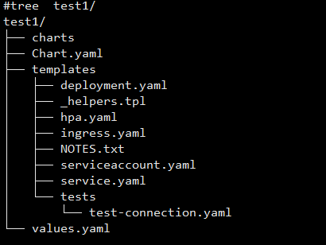

### 使用helm生成配置的脚手架
`helm create test1`
结果：  


### 基于github做分发

```
mkdir docs
helm package test1 -d docs/
cd docs/ && helm repo index . 
```
docs目录下的结构:  
  
将这个目录推送到github ,然后设置->pages中设置sources指向master分支，路径读取docs/

##### 客户端使用

helm repo add test1 https://<你的github账号>.github.com/xxx
helm repo update
helm install test1 
