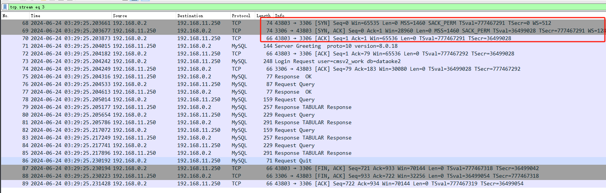
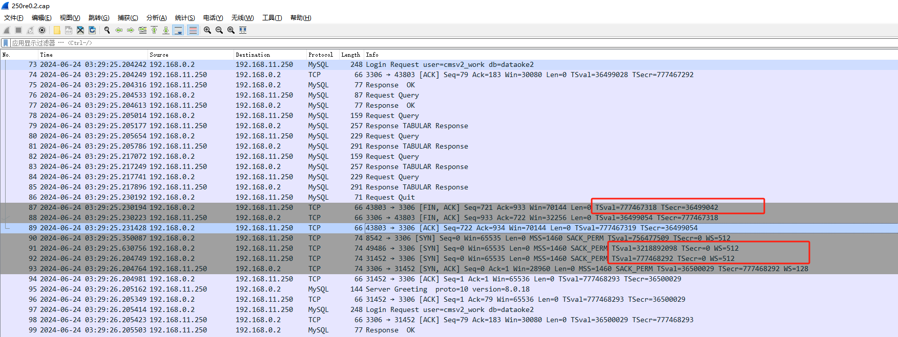

## 环境背景
- 外部物理机Mysql使用3306端口提供服务，ip: 192.168.11.250/20 后续简称服务器B
- 数十个Node的K8S集群，使用flannel网络, 挑选了一个Node作为调试端，ip: 192.168.0.2/20 后续简称服务器A

## 故障现象
- 应用pod偶现无法连接外部Mysql(服务器B)，属于断断续续的状态
- 监控外部Mysql的exporter pod也偶尔告警链接不上外部数据库(服务器B)

## 分析
### 查看无法连接外部数据库的pod所在节点
`kubectl get pod -o wide`

### 登陆节点获取容器的network namespace
`docker ps | grep $pod_name`查看到pod在主机上的容器ID

### 进容器所在的network namespace（主机上使用netstat是看不到容器的tcp链接情况的，需要进入namespace）
`cid=`docker inspect --format '{{.State.Pid}}' $containerId`   &&  nsenter --target  $cid -n`  
进入容器后，可以使用`ip add`确认ip是pod的ip地址

### 测试与外部Mysql服务器的网络连通性
`ping 192.168.11.250`  
`telnet 192.168.11.250`  

> 阶段性测试结果和猜想  
>> 1、ping 可以正常通信   
>> 2、telnet 时复现了问题，偶尔可以成功，偶尔失败（此时确认了同一时间点，Mysql可以正常提供服务，也有其它Node可以正常与外部Mysql正常通信）  
>> 3、怀疑是路由、IP冲突、防火墙策略等问题，导致telnet的流量并没有走向真实的服务器B  

双向抓包确认流量走向
- 服务器A（192.168.0.2）： 运行 `tcpdump  -i eth0 host 192.168.11.250 -w 0.2to250.cap` 获取与B的通信流量
- 服务器B（192.168.11.250）： 运行 `tcpdump -i eth0 host 192.168.0.2 -w 250re0.2.cap` 获取与A的通信流量
- 服务器A（192.168.0.2）： 反复运行 telnet 192.168.11.250 3306 直至出现不通的情况，并运行了ping 192.168.11.250测试icmp通信

分析抓包结果

在服务器A中的抓包结果中挑选一个尝试向服务器B发送握手(SYN)请求的包，进行双向分析，如下图  

> - 发起端（服务器A）结果可以看出： 发起端发送了一个SYN请求到服务器B，尝试使用本地49486端口与服务器的3306端口建链接  
> - 接收端（服务器B）结果可以看出： 收到了服务器A的SYN请求  

一个正常的握手流应该长这样才对  
      

什么情况？ telnet失败时服务器A成功发出了SYN请求，但是没有收到ACK？服务器B收到了SYN请求后，完全并没有生成ACK回应包（tcp握手基础此文省略）   
> 猜测是被内核级丢弃了流量

验证情况, 执行`netstat -s | grep -i drop` 输出  
```
    341 dropped because of missing route
    173495 SYNs to LISTEN sockets dropped
    TCPBacklogDrop: 135
```

可以看到有173495 个syn请求被丢弃了, 查看了/var/log/message 和 dmesg中的信息，并未发现明显的错误信息

在原文`https://serverfault.com/questions/235965/why-would-a-server-not-send-a-syn-ack-packet-in-response-to-a-syn-packet?newreg=72fd3ad776724f3c8d5c33f22c320b1a`
中看到有关net.ipv4.tcp_timestamps和tcp_tw_recycle的内核参数  

在服务器B上运行`sysctl -p `验证了tcp_tw_recycle=1和tcp_timestamps=1当前都是处于开启状态

> 根据个人经验，这两个参数对于处理大量time wait问题有帮助和风险（网上检索到的关于如何解决大量time wait问题的文章基本都是建议开启复用和回收），但Linux 内核4.x以后取消了快速回收选项


### 丢包原理分析

开启tcp_tw_recycle，且tcp_timestamps也开启（默认是开启的）的情况下，会触发per-host 的 PAWS 机制生效

每个TCP请求都会带上发送时时间戳，PAWS回维护最新一次通信时的时间戳（recent tsval），每收到一个包，都会与recent tsval比较，如果时间不是递增的，这个数据包就可能是过期的，于是被丢弃，

在NAT环境中（此时处于K8S的flanael环境也是属于NAT），所有的主机（pod）的出口都是宿主机的IP，在服务器B看来，就是跟同一个客户端打交道，无法区分，然而不同的pod时间可能是有差异的，请求时间戳极有可能是乱序的，就回导致服务器B校验时间戳不通过，丢弃SYN包而不发送回应包  


乱序的tsval


### 处理方法
### 方法一： 在服务器B关闭快速回收
将/etc/sysctl.conf中的tcp_tw_recycle修改设置为`net.ipv4.tcp_tw_recycle = 0 `  
### 方法二： 统一NAT环境中的时间戳（不推荐，很难实现）

