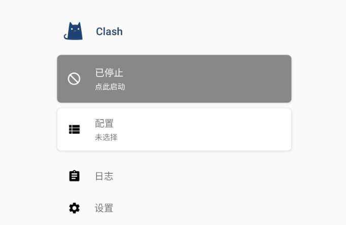
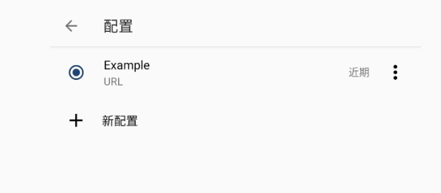

## 下载安卓客户端打开后如图

## 添加Clash配置订阅
1、前往官网复制订阅地址

2、依次点击配置 —> 新配置 -> URL  
在URL一栏中粘贴Clash配置订阅链接；自动更新(分钟)推荐填写1440，即每24小时自动从链接中更新配置文件。  
> 名称可以随便写  

完成后点击右上角保存按钮将下载配置文件，请点击 选中 添加的配置文件。

## 开启代理
1、回到 Clash for Android主页，启动服务。在弹出的设置 VPN 中点击 “允许”，Clash for Android 便开始接管系统流量。
2、点击代理，在上方模式中选择对应节点即可。您亦可以选择相应应用，使用对应的代理节点。

