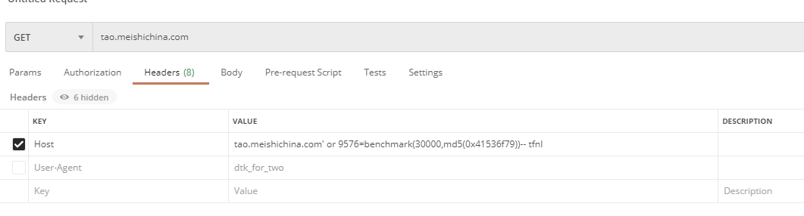

## 现象

数据库的CPU负载高，导致大量会话堆积，从而引发线上查询缓慢

## 排查问题

1、优先恢复业务原则，立刻对MySQL进行了扩容。扩容后恢复正常
2、开始溯源，分析故障时间段内的慢SQL、每个客户端的会话链接情况、较慢SQL执行次数和sql样本等。发现账号名为nginx_proxy的用户在执行如下sql
```select sleep(30)-- fgkl' OR second_domain = 'a.com';select sleep(30)-- fgkl' OR one_key_domain = 'a.com';select sleep(30)-- fgkl' LIMIT 1```
3、select sleep指令比较经典的用于探测SQL注入的测试命令
4、已知客户端IP和账号，定位到客户端为一台nginx服务器里面嵌入的Lua脚本，Lua脚本里执行了如下图的查库操作，并没有使用ORM框架，而是通过提取http host拼接的sql

```
local cms_domain = http_host
local sql = string.format("SELECT cms_domain,uid FROM dtk_user_config WHERE cms_domain='%s' OR second_domain = '%s' LIMIT 1", cms_domain, cms_domain)
```

## 尝试复现问题

成功注入，并执行了压测



原理： 假设Host为a.com or 9576=benchmark(30000,md5(0x41536f79))-- sss时，拼接出的sql是select uid from table where cms_domain='a.com or 9576=benchmark(30000,md5(0x41536f79))-- sss'
这是无法执行的，而图中通过写入一个单引号，然后再最后添加-- 注释，使string.fotmat中的引号失效，所以拼接出sql是`select uid from table where cms_domain='a.com' or 9576=benchmark(30000,md5(0x41536f79))`实现了注入

## 修复

1、改用ORM查库
2、加入通过正则对host进行过滤后合法后再提交查询
```
local domainok, err = ngx_re_match(http_host,"^(?=^.{3,255}$)[a-zA-Z0-9][-a-zA-Z0-9]{0,62}(\\.[a-zA-Z0-9][-a-zA-Z0-9]{0,62})+$","jo")
if not domainok then
    ngx_say("非法已记录")
    return
end
```

## 总结

这是一个低级的错误导致的SQL注入问题，现在框架中已经基本屏蔽了这些问题，这是使用字符直接拼接的sql，所以爆发了这个sql注入

