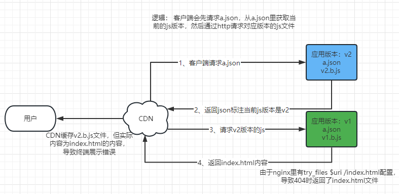

# 滚动更新+CDN+try_files配置同时使用时的问题

#### 触发条件
- 1、滚动更新时应用版本短暂不一致性  
- 2、Nginx配置了try_files
- 3、使用了CDN

如图: CDN会错误的缓存了文件，请求v2.b.js文件，实际缓存了Index.html文件





# 解决方法
修改try_files规则，当前面的try_files都无法命中时会路由到最后的/index.html配置，捕获返回No-Cache
``` 
        location / {
                try_files $uri $uri/ @fallbackIndex;
            }
        
        location @fallbackIndex {
          add_header Cache-Control "no-cache";
          rewrite ^ /index.html break;
        }

```

---
