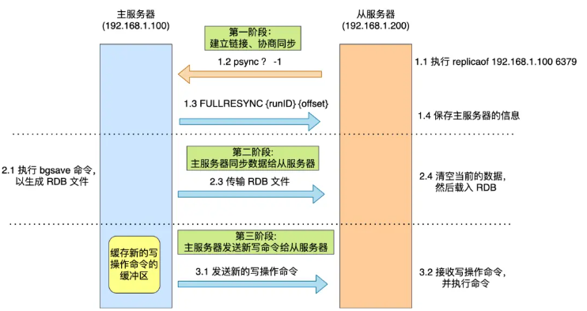

## 概念
- 主从： 解决数据复制问题 
- 哨兵： 解决高可用的问题，可以进行故障迁移 
- 集群： 解决单机能力不足问题，方便横向扩展  

## 主从复制原理  
AOF和RDB持久化技术提供了基础单机数据保障能力，但是存在单点故障。主从同步可以将同样的数据复制到其它节点上。右主节点负责写入，从节点与主节点获取数据同步
  

主从复制共有三种模式：全量复制、基于长连接的命令传播、增量复制。 
第一次同步是全量复制，接着就维持一个长连接，主服务器接收到写指令就同步给从，如果遇到网络短暂断开，就会采用增量复制，增量复制是一个圆形缓冲区（和repl_backlog_size大小有关）

## 哨兵

哨兵机制的基础工作： 监控、选主、通知

### 哨兵集群的组成

每个哨兵都通过主节点中的发布/订阅复杂__setinal__:hello做到所有的哨兵节点相互感知，然后每10s向redis主节点发送info消息获取所有的主从节点拓扑，开始监控所有的节点。至此完成的哨兵集群组建完成

## 集群
