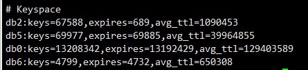

## 背景
某个集群内存一共12GB，已使用100%，但是由于存在lru回收策略，未大面积故障。

## 分析

### 1、首先怀疑是存在大量不过期的Key导致的内存100%  
  
从redis中执行info的结果来看，最大的库是db0，一共13208342个key，已设置过期时间的key有13192429个，证明约99.8%的key是设置了过期时间的    

### 2、 怀疑存在大key

1、编写的大key分析工具提取出top 50的大key和key 前缀top 50，结论是无大key
2、但是扫描完成后，发现redis的内存使用率骤降35%！目前内存使用率65%左右(编写的这个key分析工具是在线扫描，原理是通过scan遍历了redis中的key，遍历可以释放内存？)
3、使用离线key分析工具，分析夜间的RDB备份文件，分析结果中发现已过期的Key竟然占用了高达69%的内存（3.71GB）

### 3、 怀疑新增了大量的小key且过期时间较短，redis清理过期key的速度回收速度过低，直至redis内存100%

redis回收策略基础(redis对过期key的释放并不是实时的)：

> 1、访问时逐出： 每次访问key时都会判断这个key是否过期，如果过期则逐出key释放内存
> 2、serverCron定时任务逐出： 后台通过定时任务逐出部分过期Key，redis配置项hz定义了定时任务的执行周期，默认是10，代表CPU空闲时每秒钟执行10次，每次过期key清理的时间不超过CPU时间的25%（假设hz为1，一次清理时间最大为250ms，假设hz为10，则为25毫秒）。每次清理过期key都会便利所有的库。从一个库中随机抽取20个key，判断是否过期并逐出，如果存在5个以上key 过期则重复执行。清理过程中若使用了25%的CPU则会退出清理

所以理论上如果过期的key很多，会存在key已过期仍然占用大量内存的情况，需要调整redis的内存回收策略及时释放内存。

#### 处理：
- 手动执行scan进行扫描进行一次全局的key扫描，触发redis对key访问时驱逐回收策略
- 适当增加hz的值，增强redis定时扫描过期key的能力，但是hz越大会占用越多的CPU，需要根据业务进行逐步递增hz值调试

